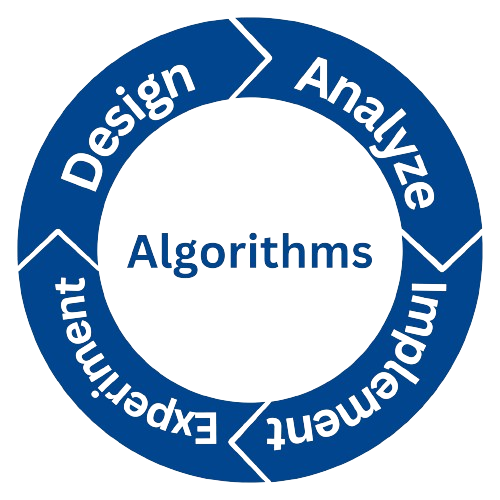
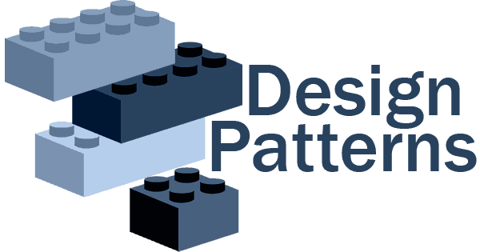

# Deep Dive

> ## Algorithms
> 
> - Sorting
> - Searching
> - Prime Numbers / GCD / LCM
> - Useful

> ## Design Patterns
> 
> - SOLID
>   1. Single-responsibility principle (SRP)
>   2. Open–closed principle (OCP)
>   3. Liskov substitution principle (LSP)
>   4. Interface segregation principle (ISP)
>   5. Dependency inversion principle (DIP)
> - DRY (Don't repeat yourself)
> - KISS (Keep it simple, stupid)
> - YAGNI (You Aren't Gonna Need It)

> ## OOP (Object Oriented Programming)
> 
> - Class and Object
> - Encapsulation
> - Inheritance
> - Abstraction
> - Polymorphism
> - Extra information
